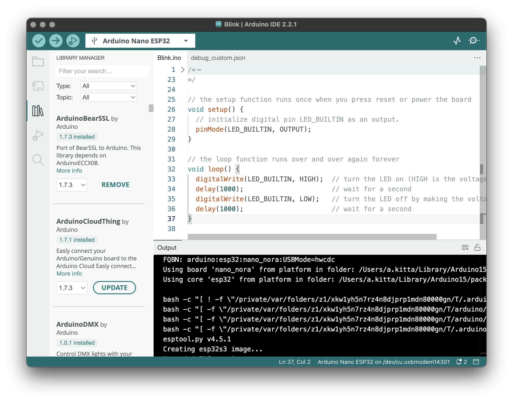

# Arduino AI IDE

[](https://github.com/sanir321/arduino-ai/actions/workflows/test-javascript.yml)
[](LICENSE.txt)

An AI-enhanced Arduino IDE 2.x built on [Theia IDE](https://theia-ide.org/) and [Electron](https://www.electronjs.org/). This fork adds an **AI Assistant** powered by Kilo AI that can write, compile, debug, and upload Arduino sketches through natural language conversations. Backend operations are handled by [arduino-cli](https://github.com/arduino/arduino-cli) running in daemon mode via gRPC.

## Features

### AI Assistant (New)
- **Natural language coding** -- Describe what you want, and the AI writes the sketch
- **Board management** -- "List my boards", "Select Arduino Uno", "Install SAMD boards"
- **Library management** -- "Find the WiFi library", "Install Servo", "Remove LiquidCrystal"
- **Sketch operations** -- "Create a new sketch", "Read the current sketch", "Edit line 15"
- **Compile & Upload** -- "Verify my sketch", "Upload to the board"
- **Code editing** -- Precise insert/replace/append edits via tool calls
- **Context-aware** -- Knows the selected board, port, detected devices, and current sketch
- **Toggle panel** -- Press `Ctrl+Alt+I` (`Cmd+Alt+I` on macOS) to show/hide the Assistant panel



### Core IDE Features
- Sketch editor with syntax highlighting (`.ino` files)
- Board Manager -- browse, install, and select Arduino boards
- Library Manager -- search, install, update, and remove libraries
- Serial Monitor & Plotter -- real-time serial communication and data visualization
- Sketchbook management -- local and cloud sketch organization
- Debugger -- launch and inspect sketches running on boards
- Compiler output with error navigation
- Dark/Light theme support
- Multi-language UI localization

## AI Agent Tools

The Arduino Assistant has direct access to 14 IDE tools:

| Tool | Description |
|------|-------------|
| `arduino-board-list` | List all connected boards with port info |
| `arduino-board-select` | Select a board and port for compilation/upload |
| `arduino-lib-search` | Search the Arduino Library Manager |
| `arduino-lib-install` | Install a library by name |
| `arduino-lib-uninstall` | Uninstall a library |
| `arduino-sketch-create` | Create a new Arduino sketch |
| `arduino-sketch-read` | Read the content of the current sketch |
| `arduino-compile` | Compile/Verify the current sketch |
| `arduino-upload` | Upload the sketch to the selected board |
| `arduino-serial-monitor` | Check serial monitor status or send data |
| `arduino-board-install` | Install board platforms (e.g., `arduino:samd`) |
| `arduino-file-explorer` | Browse files in the current project |
| `arduino-code-edit` | Edit sketch code (replace, append, or replace all) |

## Quick Start

### Prerequisites

See [PREREQUISITES.md](PREREQUISITES.md) for the full system dependency checklist.

```bash
# Node.js >=18.17.0 <21 (recommended: v20 LTS)
node --version

# Yarn Classic
npm install -g yarn
```

### Build from Source

```bash
# Clone
git clone https://github.com/sanir321/arduino-ai.git
cd arduino-ai

# Install dependencies (downloads CLI binaries, patches JSDOM)
yarn install

# Build
yarn build:dev

# Start the IDE
yarn start
```

### Development Mode

```bash
# Watch for TypeScript changes
yarn watch

# Run tests
yarn test

# Run slow/integration tests (requires CLI binaries)
yarn test:slow
```

### Bundle for Distribution

```bash
# 1. Rebuild native deps for Electron
cd electron-app && yarn rebuild && cd ..

# 2. Compile the extension and build the Electron app
yarn build:dev

# 3. Package into installer
# Linux: AppImage + .deb
yarn --cwd electron-app dist:linux

# Windows: NSIS installer
yarn --cwd electron-app dist:win

# macOS: DMG
yarn --cwd electron-app dist:mac

# Output: electron-app/dist/
#   - Arduino AI IDE-2.3.11-x86_64.AppImage
#   - arduino-ai-ide-2.3.11-amd64.deb
#   - Arduino AI IDE-2.3.11.dmg
#   - Arduino AI IDE Setup 2.3.11.exe
```

## Keybindings

| Shortcut | Action |
|----------|--------|
| `Ctrl+Alt+I` | Toggle AI Assistant panel |
| `Ctrl+Shift+I` | Open Library Manager |
| `Ctrl+Shift+B` | Open Boards Manager |
| `Ctrl+Shift+M` | Open Serial Monitor |
| `Ctrl+R` / `Ctrl+Shift+R` | Verify / Clean Verify |
| `Ctrl+U` / `Ctrl+Shift+U` | Upload / Upload Using Programmer |
| `Ctrl+N` | New Sketch |
| `Ctrl+O` | Open Sketch |
| `Ctrl+S` / `Ctrl+Shift+S` | Save / Save As |

## Architecture

The IDE consists of three processes:

1. **Electron Main** -- window management, native menus, application lifecycle
2. **Backend** (Node.js) -- filesystem access, gRPC communication with arduino-cli, language server, VS Code extension host
3. **Frontend** (Chromium renderer) -- Theia-based UI with React widgets, Monaco editor, AI chat panel

Communication between backend and frontend uses JSON-RPC over WebSocket. The AI Assistant uses the [Kilo AI API](https://api.kilo.ai) for natural language processing with tool-calling support.

## Tests

390 unit tests (Mocha + Chai) covering:
- Common modules (configuration, board detection, versioning, sketch validation)
- Browser widgets (boards, programmers, theming, DOM utilities)
- Node services (CLI daemon, language server formatting, settings, sketch discovery)

```bash
# Run all tests
yarn test

# Run tests for a specific category
npx cross-env IDE2_TEST=true npx mocha "./lib/test/common/**/*.test.js"
npx cross-env IDE2_TEST=true npx mocha "./lib/test/browser/**/*.test.js"
npx cross-env IDE2_TEST=true npx mocha "./lib/test/node/**/*.test.js"
```

## Project Structure

```
arduino-ai/
├── arduino-ide-extension/     # Theia extension (all Arduino logic)
│   ├── src/browser/           # Frontend widgets, contributions, AI chat
│   │   ├── ai/                # AI Assistant (agent, tools, chat view, Kilo provider)
│   │   ├── boards/            # Board manager UI
│   │   ├── library/           # Library manager UI
│   │   ├── serial/            # Serial monitor & plotter
│   │   ├── widgets/           # Sketchbook, component list
│   │   ├── contributions/     # Command contributions (verify, upload, save, etc.)
│   │   ├── theia/             # Theia core overrides
│   │   ├── menu/              # Arduino menu definitions
│   │   ├── style/             # CSS design tokens and component styles
│   │   └── data/              # Theme JSON files
│   ├── src/node/              # Backend services (CLI daemon, formatter, gRPC)
│   ├── src/electron-browser/  # Electron-specific code (menus, title bar)
│   ├── src/test/              # Unit and integration tests
│   └── scripts/               # Build scripts (download, patch, rebuild)
├── electron-app/              # Electron app shell
├── docs/                      # Contributor and development documentation
├── static/                    # Screenshots and static assets
└── PREREQUISITES.md           # System dependency guide
```

## License

AGPL-3.0. See [LICENSE.txt](LICENSE.txt).
